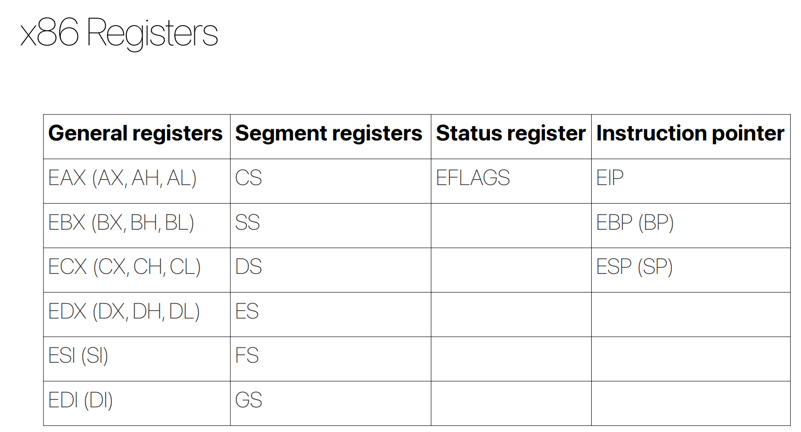

# asm 说明文档

## 寄存器
  
+ 数据寄存器
1. EAX: the primary accumulators are used in input/output and most arithmetic instructions
2. EBX: the base register could be used in indexed addressing
3. ECX: the count registers store the loop count in iterative operations
4. EDX: the data registers are also used in input/output operations, sometimes along with AX

## 指令集