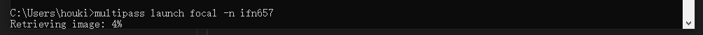
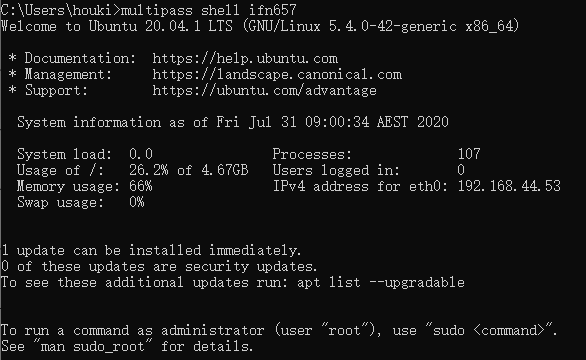
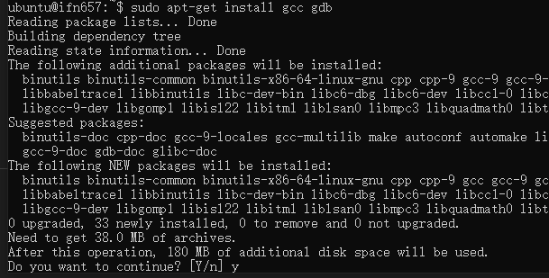

# IFN657 Tutorial 2 Linux command line basics

+ 安装Canonical Multipass  
Multipass是一个用于安装与使用Ubuntu Linux的VM工具，类似于VMWare。
    1. 下载Multipass：https://multipass.run
    2. 安装Multipass到win10
    3. 打开（运行），看到进程已存在。然后打开cmd，输入“multipass launch focal -n ifn657” --创建一个名为ifn657的ubuntu 下载时间较长，为数十分钟。  
    
    4. 运行Ubuntu虚拟机 “multipass shell ifn657”  
    

+ 基础Linux指令
    1. man 显示指令说明
    2. ls 查看目录
    3. cd 切换目录
    4. mkdir 新建文件夹
    5. cp 复制
    6. mv 剪切
    7. rm 删除
    8. cat / less 查看文本内容
    9. sudo apt update/install 更新/安装  
    安装gcc(代码编译工具) 安装gdb(程序调试工具)  
    

+ 开发工具讲解
    1. notepad++
    2. Atom 用于macbook
    3. Visual studio code 跨平台
