# IFN657 Tutorial 3 Assembly and gdb

## 正题
+ **环境准备**  
    需要准备的有gcc,gdb,gcc-multilib,nasm。可以统一使用apt install安装，我下面会逐一解释用法。
    1. gcc和gdb在tutorial2中已经讲过了。这次检查一下是否有装。  
    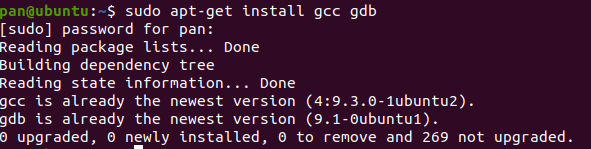  
    2. gcc-multilib的作用是选择生成的文件适用于32位或者是64位系统。一般现在都是64位系统，不安装也没事。不过还是跟着教程走一下。  
    下载安装会等一会儿。  
      
    3. 安装nasm。nasm是一款汇编与反汇编工具，可以将可执行文件解码成汇编文本。  
      

+ **程序准备**  
    准备一个C语言编写的程序，用于使用nasm解码为汇编程序。
    1. 首先用C语言编写一个HelloWorld程序。  
    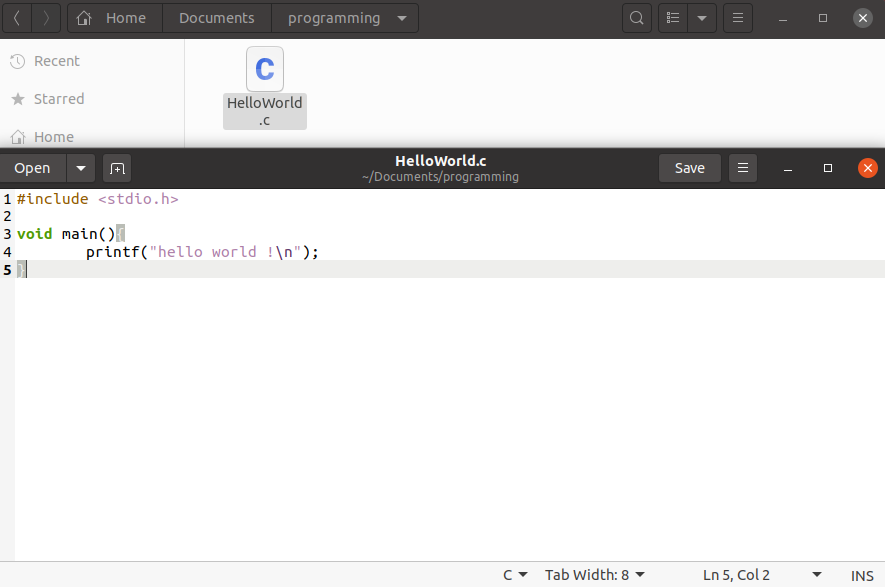  
    2. 运行C语言。不知道怎么在Linux上运行C程序的小伙伴请看附录。
    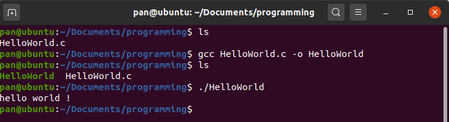  
    3. 用汇编语言编写一个HelloWorld程序  
    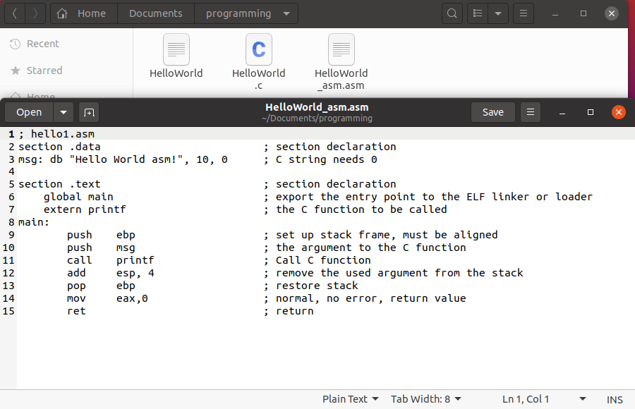  
    为了区分，我在文件名后面加了"_asm"，文件名也以asm结尾。

+ **运行基于C语言的汇编程序**  
    这是基于C语言的汇编程序版本，可以使用C语言翻译工具解析打包。
    1. 将汇编程序翻译为elf文件  
    nasm -f elf [输入文件] [输出文件]
    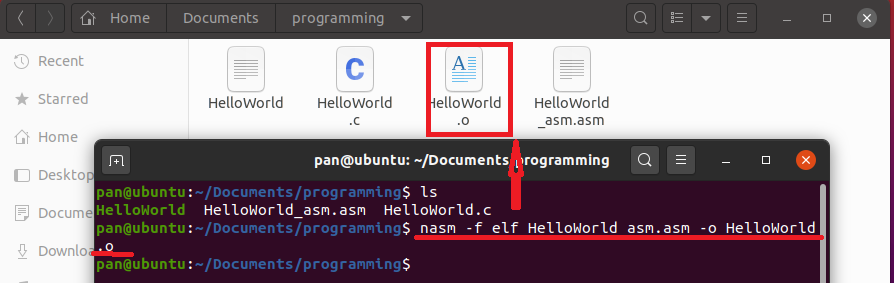  
    结果就是可以看到文件夹中多了一个.o结尾的文件。这个文件是elf可重定位文件。关于elf文件的说明参见附录。这个过程一般称为Debug。
    2. 使用gcc将.o文件翻译为可执行文件。  
    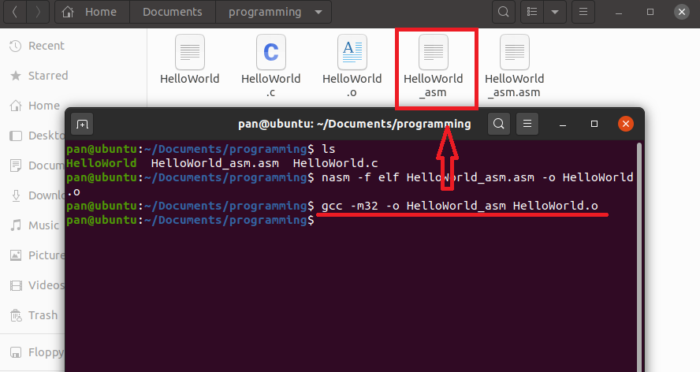  
    3. 执行可执行文件，并且查看运行结果
    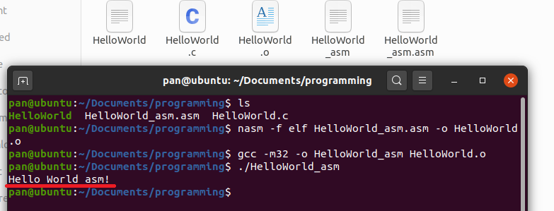  
    执行结果正常，可以参考汇编文本中的第三行。  
    当然，按照tutorial上的说法，还要将其结果保存至文本。那么可以保存一下。
    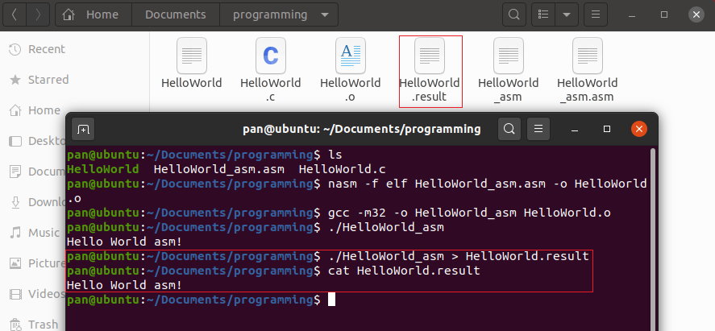  
    其中涉及">"语法，意思为将执行文件结果保存至指定文件。

+ **创建并运行纯汇编程序**  
    接下来要创建的是纯汇编语言，功能依然是输出Helloworld，但是代码会不同，也不再可以使用gcc翻译打包。
    1. 创建纯汇编程序  
    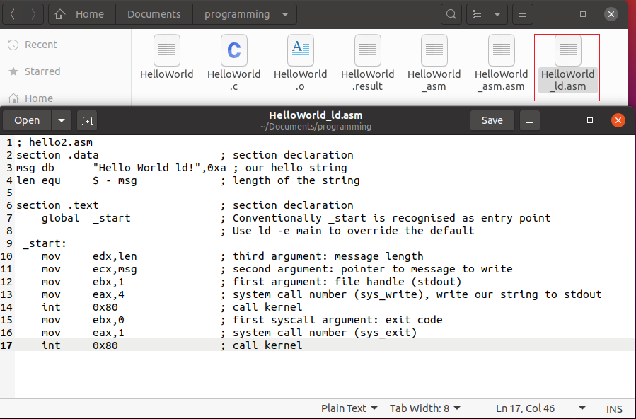
    2. 将代码编译，跟前一个例子一样。
    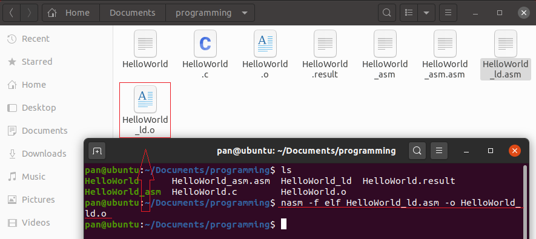
    3. 编译运行一步到位。  
    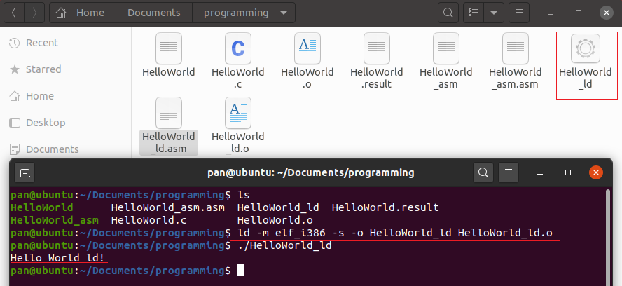

+ **使用gdb进行断点调试**  
    断点调试意为在程序运行到某一处时停止，此时可以查看程序当前状态。
    1. [算了我明天早上再写]


## 附录

+ **在Linux中使用gcc运行C语言程序**  
    所有的程序启动都要经过2步，编译与运行。
    1. 编译  
    编译工具将会把源代码翻译为二进制文件，此处使用的工具为gcc。  
    语法为"gcc [输入文件] [指定输出文件] [输出文件]"  
    输入文件一般为.c结尾的C源代码文件。输出文件一般没有后缀。-o为指定输出文件名，可不写，不写会有默认文件名。
    执行完之后可以在目录下看到新产生的一个文件，即你指定的输出文件。那个文件用来运行，而.c文件不能直接被运行。
    2. 运行
    直接输入输出文件名即可运行。如果.c文件有改动，那么要重新编译运行，就是重新做一遍流程。
+ **Linux中的elf文件**
    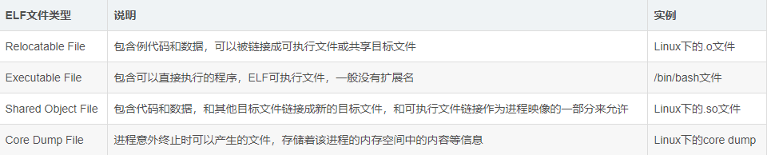

## 参考

+ 基于C语言的HelloWorld汇编程序  
```
; hello1.asm  
section .data                		; section declaration  
msg: db "Hello World asm!", 10, 0 	; C string needs 0  
  
section .text     			; section declaration              
    global main  			; export the entry point to the ELF linker or loader  
    extern printf			; the C function to be called  
main: 
	push	ebp   			; set up stack frame, must be aligned 
 	push	msg   			; the argument to the C function 
 	call	printf			; Call C function 
 	add	esp, 4			    ; remove the used argument from the stack 
 	pop	ebp 			    ; restore stack 
 	mov	eax,0			    ; normal, no error, return value 
 	ret                   	; return
```

+ HelloWorld纯汇编程序  
```
; hello2.asm     
section .data                   ; section declaration 
msg db      "Hello, haxor!",0xa ; our hello string 
len equ     $ - msg             ; length of the string 

section .text                   ; section declaration 
    global  _start              ; Conventionally _start is recognised as entry point 
                                ; Use ld -e main to override the default 
 _start: 
    mov     edx,len             ; third argument: message length 
    mov     ecx,msg             ; second argument: pointer to message to write 
    mov     ebx,1               ; first argument: file handle (stdout) 
    mov     eax,4               ; system call number (sys_write), write our string to stdout 
    int     0x80                ; call kernel 
    mov     ebx,0               ; first syscall argument: exit code 
    mov     eax,1               ; system call number (sys_exit) 
    int     0x80                ; call kernel
 ```