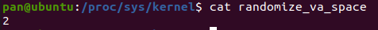
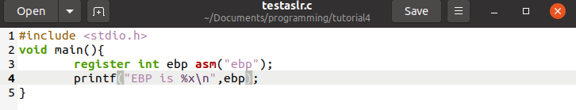
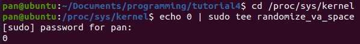
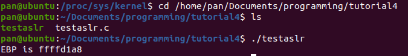
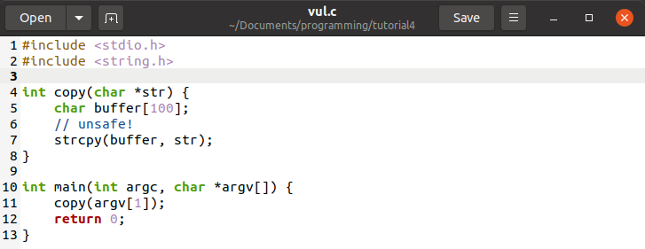
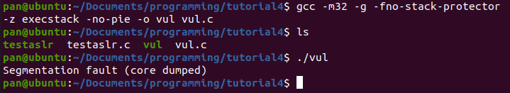
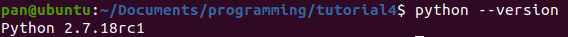
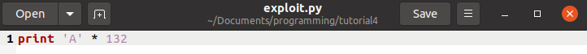
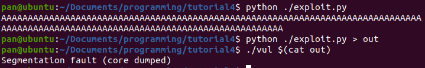
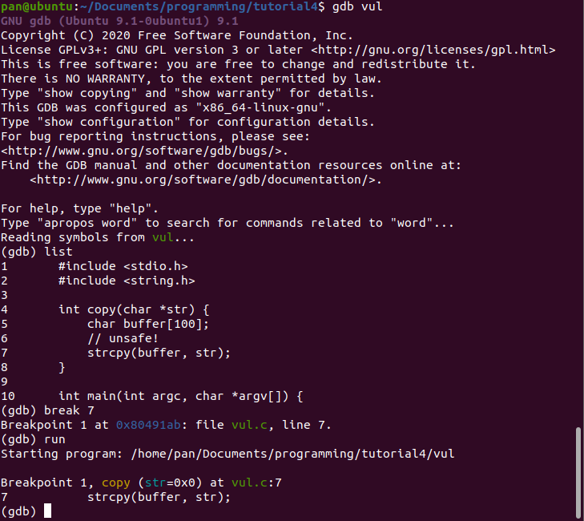

# IFN657 Tutorial 2 Buffer Overflow Part 1

## 正题
+ 测试ASLR
1. 查看ASLR是否打开    
      
2. 准备测试用C程序  
      
3. 运行C程序  
      
4. 关闭ASLR  
      
5. 再次执行C程序
      

+ 测试危险C程序
1. 代码  
    
2. 执行  
    

+ python
1. 安装python  
    
2. 代码  
    
3. 查看运行结果并保存  
    
4. gdb调试  
    