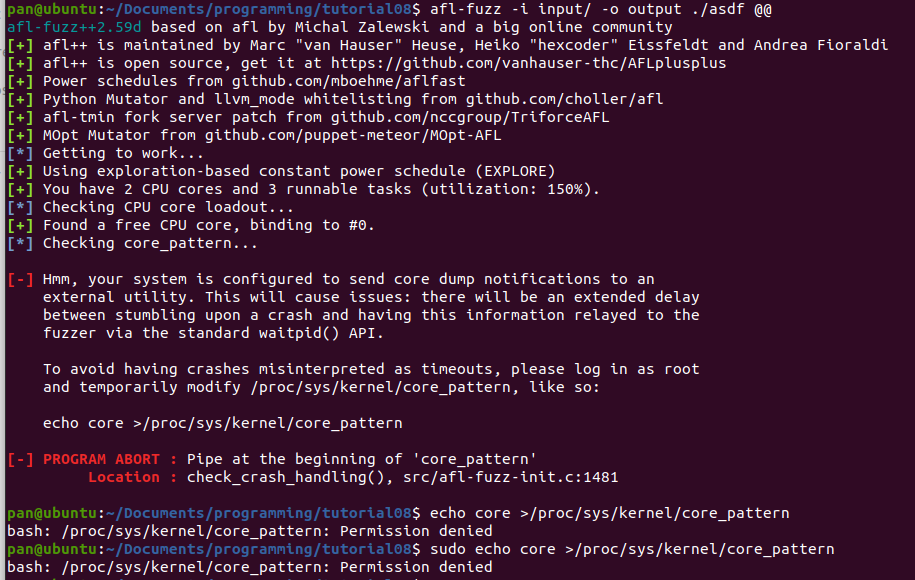
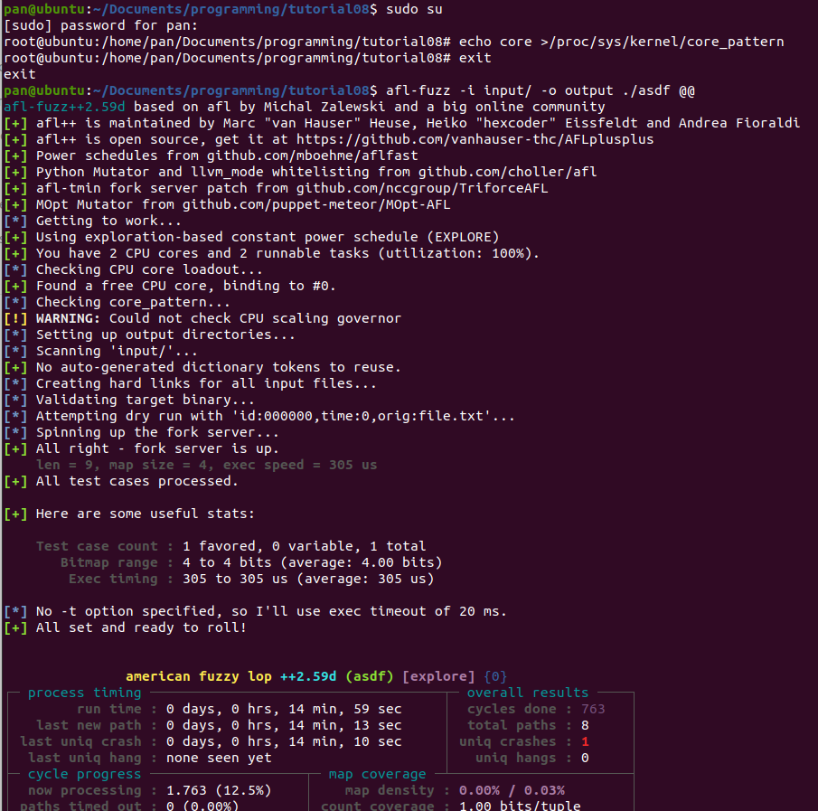

补充一个tutorial上没有讲到的点：  
Ubuntu上运行fuzz时候，会遇到崩溃异常转递的问题。具体如下  

```
your system is configured to send core dump notifications to an external utility
```
解决方法是，进入root。输入以下代码：  

然后就可以看见正常运行了。  
看到有uniq crashes就可以停了，不然他会一直跑。  
按ctrl+c结束。结束之后看到output文件夹里，进crashes->id:000000...那个文件夹，里面就是内容。