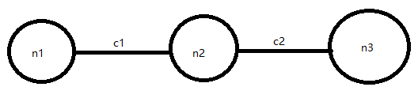
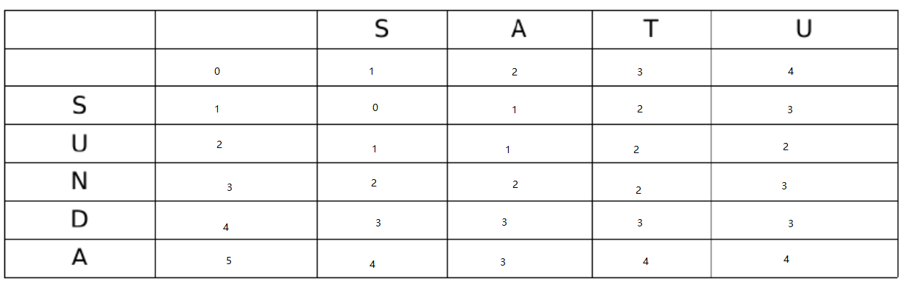

# Exam
+ DFS and A*  
DFS深度优先算法，优先遍历节点下的子节点，再遍历其他节点。在图的模式下，它会把已遍历的节点标记为已读，再次访问不会再遍历已读节点，以此来避免重复，其实现原理为set。DFS内部结构是栈，根节点是栈的第一个元素（图的话任选1个），然后进行出栈操作，并此节点的子节点进行入栈，直到目标节点入栈，或者达到目标。  
```
def tree_search(problem, frontier):
    """
        Search through the successors of a problem to find a goal.
        The argument frontier should be an empty queue.
        Don't worry about repeated paths to a state. [Fig. 3.7]
        Return
             the node of the first goal state found
             or None is no goal state is found
    """
    assert isinstance(problem, Problem)
    frontier.append(Node(problem.initial))
    while frontier:
        node = frontier.pop()
        if problem.goal_test(node.state):
            return node
        frontier.extend(node.expand(problem))
    return None

def depth_first_tree_search(problem):
    "Search the deepest nodes in the search tree first."
    return tree_search(problem, LIFOQueue())

def depth_first_graph_search(problem):
    "Search the deepest nodes in the search tree first."
    return graph_search(problem, LIFOQueue())

def LIFOQueue():
    """
    Return an empty list, suitable as a Last-In-First-Out Queue.
    Last-In-First-Out Queues are also called stacks
    """
    return []
```
A*算法是在队列的基础上，对于搜索顺序进行了排序。BFS在入队操作时入队顺序为随机，而A星会计算每个子节点与目标的距离（特用于图）。以距离最近者优先遍历。因此开销会极大减少，而计算距离也是算法的关键。这一点可以参考tutorial4中的PriorityQueue。距离h是目前状态到目标状态的距离，在作业1中为箱子到目标的横纵坐标之和。h必须小于实际长度（0<=h<实际长度），不然h无效。
```
def best_first_graph_search(problem, f):
    """
    Search the nodes with the lowest f scores first.
    You specify the function f(node) that you want to minimize; for example,
    if f is a heuristic estimate to the goal, then we have greedy best
    first search; if f is node.depth then we have breadth-first search.
    """
    node = Node(problem.initial)
    if problem.goal_test(node.state):
        return node
    frontier = PriorityQueue(f=f)
    frontier.append(node)
    explored = set() # set of states
    while frontier:
        node = frontier.pop()
        if problem.goal_test(node.state):
            return node
        explored.add(node.state)
        for child in node.expand(problem):
            if child.state not in explored and child not in frontier:
                frontier.append(child)
            elif child in frontier:
                # frontier[child] is the f value of the 
                # incumbent node that shares the same state as 
                # the node child.  Read implementation of PriorityQueue
                if f(child) < frontier[child]:
                    del frontier[child] # delete the incumbent node
                    frontier.append(child) # 
    return None

def astar_graph_search(problem, h=None):
    """A* search is best-first graph search with f(n) = g(n)+h(n).
    You need to specify the h function when you call astar_search, or
    else in your Problem subclass."""
    h = memoize(h or problem.h, slot='h')
    return best_first_graph_search(problem, lambda n: n.path_cost + h(n))

def astar_tree_search(problem, h=None):
    """A* search is best-first graph search with f(n) = g(n)+h(n).
    You need to specify the h function when you call astar_search, or
    else in your Problem subclass."""
    h = memoize(h or problem.h, slot='h')
    return best_first_tree_search(problem, lambda n: n.path_cost + h(n))
```
+ 数据结构和启发式算法  
数据结构无非：栈，队列，树  
启发式算法。即上文中的h。2个特性，admissible可容性和consistency一致性。  
可容性：计算当前状态到目标状态的距离时，保守估计。其估计结果必须<=实际结果。对于assignment1而言，箱子所处位置为当前状态，空格为目标状态。那么可以使用横纵坐标相加法，来保证其必然小于等于实际走的路程。  
一致性：当前节点到目标的h一定<=下一条到目标的h+当前节点到下一跳的实际开销。什么意思呢，看下图。  
  
目前我们在n1，目标为n3，我们算出的h为h1。下一跳在n2，h为h2。图中c1，c2为n1到n2，n2到n3的实际开销。现在有公式：  
h1<=h2+c1  
为什么呢？因为h是在当前节点的估计值，是保守估计的（admissible）。它的值会小于c1。换句话说，当人在计算h1时，并不知道c1是多少。此时h1实际上是由h2 + evaluate c1 得到的， 而 evaluate c1 一定<= c1， 因为admissible的存在。 然后等走到n1时候，知道了实际开销c1， 那么就不必再evaluate了。那么evaluate c1 <= c1 ，evaluate c1 + h2 也一定 <= c1 + h2 也就是 h1<=h2+c1  
例题中有给图让分析h的范围，就以此判断。注意，如果节点n有多条前置路径， 那么 h(n)+c(n-1)必须大于h(n-1), 对所有路径都要满足。
+ 编辑距离  
DP的一个内容，讲的是2个字符串s1,s2， 从s1变化到s2需要花费的最短路径。变化分为增加，减少，替换，各为1 cost。现在，可以画一张表格来表示其最短路径。  
  
有2个字符串SAUT和SUNDA。现在看表格中第1行和第1列为空，代表空串，往后S代表字符串S，再往后A代表字符串SA，最后一列U代表整个字符串SATU。横向也一样。现在进行操作。每一格如果对应横纵向不一样（空串跟空串一样），那么在其左，上，左上选一最小的格子内容+1,。如果一样，则直接把最小的值搬下来。现在整张表做完就是这样。  
右下角那个格子代表就是SAUT转化到SUNDA最短路程。步骤为，以SUNDA为参照，第一步，保留SATU首字母S不变，0 cost。2，替换A到U， 1 cost。3，替换N为T, 1 cost。4，替换D为U, 1 cost。5， 加A, 1 cost。