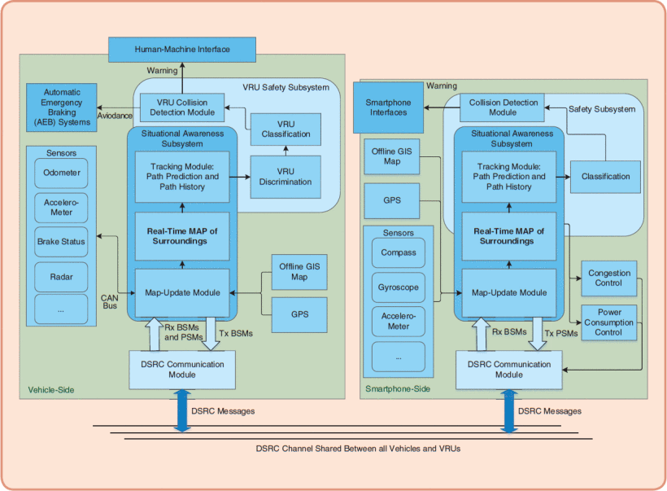

# 题目：Vehicle to Vulnerable Road User Communication: Survey, Design Considerations, and Challenges  

## placeform reference文件
+ **Performance analysis of bicycle-to-pedestrian safety application using bluetooth low energy.**  
    本文主要讲了非机动车与行人之间的安全问题，设计了一种蓝牙安全策略，并且设计了一个实验。非机动车容易撞到行人，建立非机动车与行人的通讯可以降低相撞几率。此处使用BLE建立通讯。BLE是一种蓝牙模块，特点是低功耗，便宜，通讯范围远。因此，可以使用蓝牙模组进行通讯，会比使用网络更加快。  
    实验使用了GPS，蓝牙，三星Galaxy S7 (安卓7.0)， 自行车。由行人拿着三星手机，手机里装好了蓝牙模组，GPS与报警app。当行人靠近自行车，手机将会报警。实验结果为，这套安全系统受行人，自行车的移动速度影响较大，也受安全程序传播频率影响。当双方移动速度较快，程序则会来不及反应。传输频率低，也会导致无法及时传输信息，发出警报。GPS定位误差也会导致程序的错误计算。
    根据实验研究得出的故障改进方法：1，GPS误差要更小。2, 风险评估系统要更加灵敏。3，信标丢失，也就是指信号不稳定会导致传输不及时，也会间接导致系统来不及报警。4，设立最佳信标传输间隔，也就是实时信息传输频率。此频率需要能自动适应状况，以求达到及时反应与节能。
    结论：基于BLE的B2P安全应用程序的可靠性将会影响系统应急能力，需要继续研究。

+ **Implementation and Evaluation of a Cooperative Vehicle- to-Pedestrian Safety Application**  
    https://ieeexplore-ieee-org.ezp01.library.qut.edu.au/document/8082781

    本文提出了一个V2P(vehicle to people)框架。讲述了此框架的结构，VRU安全模块，以及评估。
    1. 框架结构  
      
    V2P中有车辆和行人2大用户。所有车辆和行人都配备WSU(无线安全模块)。WSU中包括GPS和传感器，有速度传感器，制动状态，雷达等。GPS将联合Google Map进行道路分析。这些信息处理后会发送给用户。  
    此框架重心在于情景模块。情景包括地图，环境和跟踪。此模块使用了GPS和DSRC模块技术，可以实时记录周围实体，可以记录用户运动路径历史，预测运动发生。
    2. VRU安全模块  
    此模块由VRU判别组件，VRU分类组件和VRU碰撞检测模块组成。VRU判别组件用于区分使用者的用户类型，是行人，骑车的人或者是动物。但是由于这个设备可以被装在手机上，因此有时无法准确做出判断。VRU分类组件用于标记用户目前处于什么状态下，是处于安全，风险还是危险区域。VRU碰撞组件用于分析当前用户的运动模式，预警碰撞发生。此处用到了数学理论与碰撞算法。
    3. 评估
    这套系统可以在碰撞发生10秒之前作出预警。

+ **Vehicle-to-Pedestrian Communication for Vulnerable Road Users**  
    https://www.ncbi.nlm.nih.gov/pmc/articles/PMC6359035/  

    本文提出了一个V2P设计框架。并且就此框架进行了测试。
    此框架基于经典的V2P框架设计，即在车辆与VRU之间交换安全信息。此通讯可以使用ad-hoc或者蜂窝。接着，此系统将会进行检测，跟踪，预计。共分为4个模块：车辆装置，VRU设备，基础设施，信息处理单元。  
      

    然后将V2P系统的输入进行划分，分别分析。类别包括，用户，通讯方式，应用类型(安全型，便利型)，接收方，通讯技术，VRU设备(手机，头盔，标签)。 
