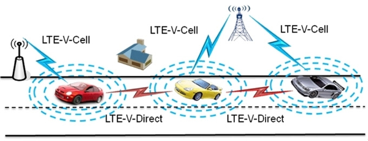

V2P，全程为vehicle to people，指的是车辆与行人之间的通讯。这个技术最开始是包含在智能驾驶中的一个分支，用来帮助车辆来判断周围是否有人。当然要判断的不仅仅是只有人，还有其他车辆V2V，有道路标识V2R等等。V2R目前使用很广泛，很多收费口都是用这种远程识别系统，避免了车辆停车缴费，可以自动扣费。目前，V2P，V2R这些技术，统称为V2X，也就是车联网。  

回到正题。V2P是一个什么样的通讯系统呢？如何做到车辆与人的通讯的呢？首先，V2P系统的目的是避免车辆与行人之间的交通事故，避免的方法就是在即将发生事故的时候发出预警。其工作流程为，1，收集双方信息。收集驾驶员和行人的信息。2,预测事故发生，使用算法，数据模型等，推测车辆，行人可能的行车路线。3，发出预警，如果判断下来会发生碰撞，也就是事故，就会报警通知双方。本文也就将从这三个方向出发讨论这个题目。  

首先是收集双方信息。双方的信息包括哪些内容？位置，速度，方向，开的什么车，等等。位置的话，基本上使用的是GPS。包括Yanming的另一个题目"Modelling multipath effects in satellite signals using Machine Learning tools"讲的就是GPS精确定位。而且这个定位是否精准是个非常重要的。在多篇文章中提到GPS定位不准确会极大影响系统效果。速度，方向等信息，主要是通过设备传感器-手机上的传感器收集。交通工具类型，这个是个非常有意思的信息。设想一个场景，如果一个骑自行车的人和一个行人同时在马路上前进，骑自行车的人可能会从后面骑过来，超过了行人，那么是很合理的。但是在系统看来，这是很危险的，类似于追尾。实际上，双方在不同的车道上，是不会有危险的，但系统并不能区分出车道。另外这个信息不太好由系统自行判断，需要用户填写，所以准确性不好保证。

信息收集好了之后，就是预测系统了。系统的预测会基于传感器收集的信息，进行行为轨迹判断。其实这个功能说起来很简单。比如一个行人在横穿马路，一辆车也在马路上开，假设双方不减速，过会儿就会相撞。那么系统就会报警。此处用到的原理也很简单，把双方运动轨迹算出来，看一下后面会不会有重合的可能。但是，光做到这点是不合格的。首先，司机看到行人自然会刹车。如果视野很好距离很远，那么这时候不必要报警。第二，行人如果改变运动倾向，比如停下来了，那也不需要报警。第三，根据用户的道路习惯进行判断，比如用户是属于急躁型的，喜欢冲闯，那么需要报警。如果比较小心的，可以不必报警。等等这些都是一些环境因素。那么看一下目前已有的V2P碰撞预测系统是怎么做的。

首先定义了碰撞危险区域等级。大致为3种，1，不可避免，2，危险，3，安全。继续沿用上面一个例子。当距离很远时（大于安全距离），就算测算出双方会碰撞，但也不必报警。当双方继续保持移动，距离缩小到安全距离以下，会报警。还有一种情况，是报警之后依旧没有改变运动轨迹，此时距离缩短到不可避免碰撞距离，那么继续报警，（但报警似乎显得没有意义？）。对这些区域的划分要根据驾驶员反应速度，车辆速度，车辆制动能力，路面情况，等多方面考量。

最后是警报通知。功能为通知双方即将会发生碰撞。目前有2种做法，1，传统做法，此系统为传统C/S结构，双方等待服务器发送信息。具体就是我的手机下个app，日常数据都是app传给服务器，汽车的数据也是传给服务器，如果有危险，也是服务器那里算出来了告诉手机。这个是实现起来简单，但是实际运行效果不好。不好的原因是服务器响应慢。这个系统如果用户多了，服务器的负荷很难说能不能在1秒之内给出结果（1秒在马路上已经很远了）。2，目前普遍4G，网速不一定能足够快传递消息。这一点5G起来了之后可能会有所改善。3，有些山里没网。

那么看第二种做法。第二种是收集到的数据直接在用户端计算，并且通过一些通讯方式告诉对方通讯方式包括网络，蓝牙，RFID等等，这样就跳过了服务器的限制。那么按照这种C/C客户端直接通讯的结构来看，处理信息的负担以及传输的负担都会大大降低。那么这种结构的难度就在于通讯的稳定性以及距离。目前比较流行的是DSRC和C-V2X。DSRC是基于长距离RFID的微波无线传输技术。这种技术目前可以最大支持1000米的通讯。工作原理是，双方都有接收器和发送器，发送器按一定频率广播信号，接收器可以侦测到附近的人发出的信号。那么一旦侦测到，就可以发送数据。目前这个技术的问题在于，距离过远或者中间有障碍物会导致丢包。

还有一种做法是使用C-V2X。C-V2X全称Cellular-V2X，也叫LTE-V2X，蜂窝V2X。C-V2X比较新，在2016年被首次提出，目前运用极其广泛（可以参考奥迪，福特等车目前的V2X解决方案）。由于这种技术是基于蜂窝网络，又可以实现设备之间的相互通讯，因此它除了可以实现基本的人车通讯，还可以很好地将车辆与道路结合，比如得到红绿灯提示等。这种特性也被业内视作车联网的未来。其网络部署大致如下图。  
  
可以看到，车与车之间可以直接通讯。那么对于V2P结构来说，相当于把车替换成人。这种技术的带宽跟DSRC差不多，目前都能到20M左右（其实原理就是wifi）,但是传输延时变低很多，稳定性也好。

最后谈一下蓝牙。蓝牙与V2P系统结合，应该是结合在哪一环呢？我先不做说明，大家可以先看一下蓝牙5.0的特性先考虑一下。
+ 蓝牙5.0针对低功耗设备，有着更广的覆盖范围和速度提升。
+ 蓝牙5.0会加入室内定位辅助功能，结合Wi-Fi可以实现精度小于1米的室内定位。
+ 低功耗模式传输速度上限为2Mbps,是之前4.2LE版本的两倍。
+ 有效工作距离可达300米，是之前4.2LE版本的4倍。
+ 添加导航功能，可以实现1米的室内定位。
+ 为应对移动客户端需求，其功耗更低，且兼容老的版本。
我认为有2个优势。第一，在GPS无法精确定位的时候，蓝牙可以辅助定位。GPS提供大方向，蓝牙提供具体信息。二，用于传输。其实使用蓝牙完全代替蜂窝网络，我是不赞成的，300米的距离是不够的。但是在一些蜂窝网络无法覆盖的地方，比如隧道，地下，可以使用蓝牙进行辅助传输，这个是个很好的设想。第三就是节能，比网络模块节能这是毋庸置疑的（你手机开蓝牙耗电快还是开热点耗电快）。那么缺点在哪呢？刚刚说了距离300米是有点短，还有就是传输速度。2M/s的速度，关键看数据多不多。如果只是做V2P，我觉得可以。如果是在V2X的主干上，我觉得不行。

最后说一下。我认为没有一个技术是注定没用的，相辅相成是最后的结果。我虽然倾向于蜂窝网络，但是一套V2P的系统，适当的使用DSRC和蓝牙，也是可以弥补一些场景的不足。那么，至于选研究题目和方向，我觉得看到这里，你自然有很多东西想去了解，那么这就是这篇文章的主要目的，OK。